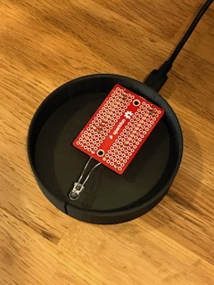
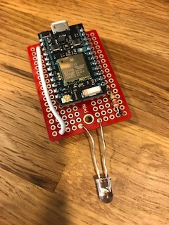

# iot-echo-particle
*Enables your Alexa skill to draw attention to an Echo device.*

These instructions describe how to build a little stand for your Echo device. Inside the stand is a remote controllable LED that is super easy to turn on and off using just a HTTP request.

With this building block you'll be able to extend your Alexa skill to alert you when there's anything interesting or urgent to share with you. Your skills app can turn on the blinking light in the Echo stand these instructions tell you how to build. Then, for example, you could share the news with a skill that reacts to: "Alexa, ask ```<SKILL>``` what's up?".

Assembly required, but opportunities are endless as a result.

Below, we list the 3D print files and trivial C file for the Particle.io/Photon device. The base fits the Amazon Echo as well as the Echo Dot (old and new models). The dimensions won't work for the Echo Show and Echo Look.

# What you get


# What's inside
The Photon's micro usb connector fits so snug that it helps hold the Photon device in place.



We used a little [board](https://www.sparkfun.com/products/12702) to solder the resistor and LED onto.



# What you need
You'll need a few parts, and access to a 3D printer.

1. a [Particle account](https://www.particle.io/)
2. a [Photon](https://store.particle.io/collections/photon) device ($18 in 2017)
3. a 330 Ohm resistor and a LED - see [here](https://learn.sparkfun.com/tutorials/sparkfun-inventors-kit-for-photon-experiment-guide/experiment-1-hello-world-blink-an-led) for example
4. a little [board](https://www.sparkfun.com/products/12702) to solder the resistor and LED into
5. a soldering iron to connect the resistor and LED to the Photon's pins
6. a 3D printer - we used a [Zortrax 200](https://zortrax.com/printers/zortrax-m200/), but any other printer will do just as well (the parts are trivial)
7. transparent material [z-glass](https://store.zortrax.com/m200-z-glass) for the light ring
8. regular ABS material for the base
9. about 3-4 hours of time to print and tinker

If you don't have access to the transparent material, you could modify the base part and add a vertical opening at the front for the LED light to shine through. The Echo devices can stand both on the base directly as well as on the layered ring.

# Printing the parts
Only two parts are needed. The larger base (printed black), and the much smaller transparent material ring.


The transparent material ring is thin. Depending on your material it may be somewhat brittle and it may take patience to get it off the printer baseplate without breaking. Take your time and don't rush getting it off!

# The little bit of code
[```EchoParticle.ino```](./EchoParticle.ino) contains the code that runs on the Photon device inside the 3D printed base. Use the Particle IDE, CLI, or web interface to flash the Photon device.

# How to remote control the LED

First get the ```<DEVICEID>``` and account specific ```<TOKEN>``` from the Particle.io dashboard or IDE and use it below. Send the following HTTP requests to the Photon device inside the base of the stand:

To enable blinking:
```curl https://api.particle.io/v1/devices/<DEVICEID>/alert -d access_token=<TOKEN> -d "args=on"```

To stop the blinking:
```curl https://api.particle.io/v1/devices/<DEVICEID>/alert -d access_token=<TOKEN> -d "args=off"```

# What next?
Feel free to modify and re-use as you like! Have fun!
